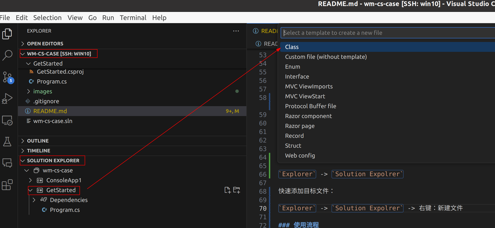
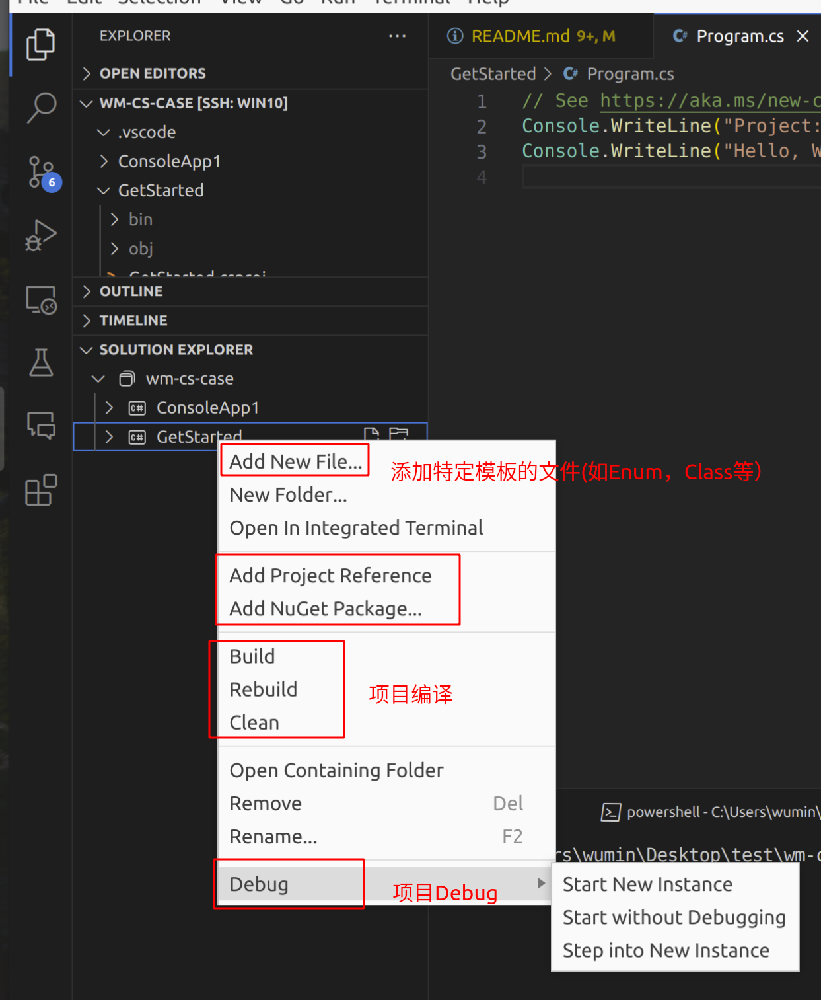
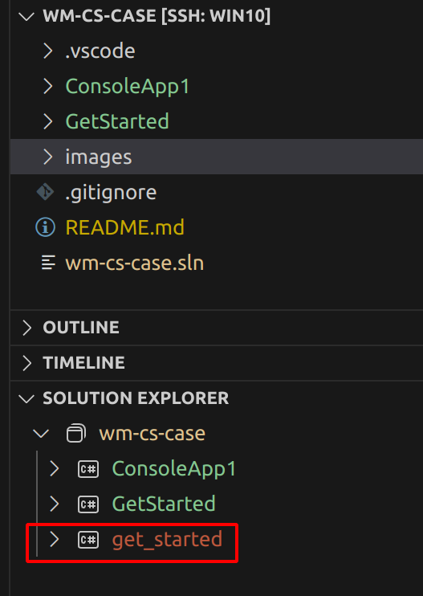
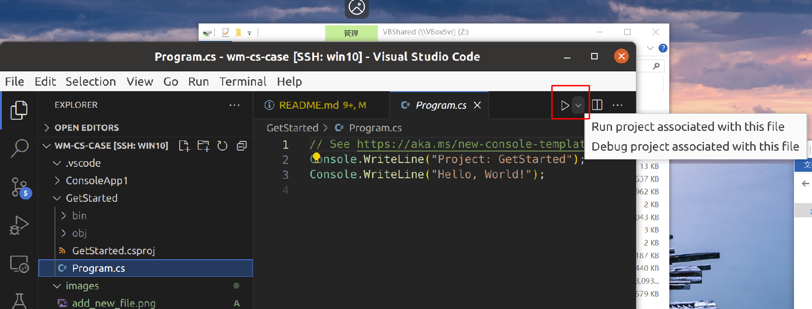
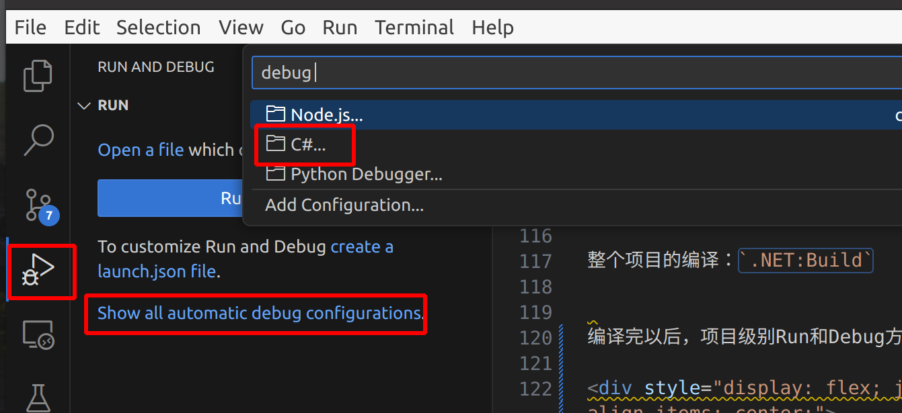

## wm-cs-case
wcc: csharp test


包含：C#，WPF

关键问题：

1. IOC注入和prisma框架
2. 基础语法（委托等）
3. 单元测试
4. 调试
5. 委托
6. NuGet
7. 打包
8. 格式化


## Quick Start

### 基础操作

```shell
dotnet --version
dotnet --list-sdks
dotnet --info
dotnet -h

# first console project
dotnet new console -o sample1
cd sample1
dotnet run
```

VSCode中需要安装3个插件：

- `C# Dev Kit`
- `C#`
- `IntelliCode for C# Dev Kit`

其他可能需要装的：Markdown, python, C/C++, Copilot, GitGraph等

VSCode中的一些常见设置：

左下角 `Manage` -> `Settings`，做一些设置，如Tab Size等，以及这个插件(C#...)的一些设置。

这里设置了Tab Size为2，同时设置了C#的部分[Inlay Hints](https://devblogs.microsoft.com/java-ch/java-on-visual-studio-code-2023-07/)。这部分参考了 [Installing C# Dev Kit](https://www.youtube.com/watch?v=S4Rks1L03LI)


使用VSCode的引导功能：

`Ctrl + Shift + P` -> `Welcome: Open Walkthrough` -> `Get Started with C# Dev Kit`: 然后选择对应的操作

直接创建.NET项目:

`Ctrl + Shift + P` -> `.NET:New Project` -> `Console app`

编译.NET项目：
<!--  -->
`Ctrl + Shift + P` -> `.NET:Build` or `.NET:Rebuild`，这会编译Project下的所有代码。

Clean .NET项目：

`Ctrl + Shift + P` -> `.NET:Clean`

快速添加模板文件：

`Explorer` -> `Solution Expolrer` -> 右键：新建文件

<div style="display: flex; justify-content: center; align-items: center;">
  
</div>

查看项目的依赖：

`Explorer` -> `Solution Expolrer`

其他：

<div style="display: flex; justify-content: center; align-items: center;">
  
</div>

### 使用流程

可以创建好几个project，比如 `ConsoleApp1`、`GetStarted`和 `get_started`

这时候可以在 `wm-cs-case.sln` 中看到有3个项目的信息。

使用`.NET:Build`编译所有这3个项目。然后cd到bin目录下执行程序。

如果编译失败，可以先 Clean 再编译。

如果是删除了其中的某个项目，重新build会失败，这时候可以手动更新 `wm-cs-case.sln` 中不存在的项目。或者是在VSCode的`Explorer` -> `Solution Expolrer`下删掉对应的项目，这会自动更新 `wm-cs-case.sln`


<div style="display: flex; justify-content: center; align-items: center;">
  
</div>

运行单一文件方法：

（如果运行失败，可以尝试 clean + rebuild）

<div style="display: flex; justify-content: center; align-items: center;">
  
</div>

### Build

Debug之前需要先编译。

编译方法有：`.NET:Build` or `tasks.json` or 脚本/指令编译

`.NET:Build`： 整个项目编译

`tasks.json`：参考。可以使用 `Ctrl + Shift + P` -> `>.NET: Generate Assets for Build and Debug`。然后在菜单栏的 `Terminal` -> `Run Task` 选择执行

```json
{
  "version": "2.0.0",
  "tasks": [
    {
      "label": "编译",
      "command": "dotnet",
      "type": "process",
      "args": [
        "build",
        "${workspaceFolder}/wm-cs-case.sln",
        "/property:GenerateFullPaths=true",
        "/consoleloggerparameters:NoSummary;ForceNoAlign"
      ],
      "problemMatcher": "$msCompile"
    },
    {
      "label": "部署",
      "command": "dotnet",
      "type": "process",
      "args": [
        "publish",
        "${workspaceFolder}/wm-cs-case.sln",
        "/property:GenerateFullPaths=true",
        "/consoleloggerparameters:NoSummary;ForceNoAlign"
      ],
      "problemMatcher": "$msCompile"
    },
    {
      "label": "文件观察程序",
      "command": "dotnet",
      "type": "process",
      "args": [
        "watch",
        "run",
        "--project",
        "${workspaceFolder}/wm-cs-case.sln"
      ],
      "problemMatcher": "$msCompile"
    }
  ]
}
```

脚本/指令编译： dotnet build or msbuild，方便在CICD中进行

dotnet build是dotnet cli的一部分， msbuild需要另外安装。

参考：[Build Tools](https://code.visualstudio.com/docs/csharp/build-tools), [.NET CLI 概述](https://learn.microsoft.com/zh-cn/dotnet/core/tools/)

> 对于目标版本低于 .NET Core 3.0 的可执行项目，通常不会将 NuGet 中的库依赖项复制到输出文件夹。 而是在运行时从 NuGet 全局包文件夹中对其进行解析。 考虑到这一点，dotnet build 的产品还未准备好转移到另一台计算机进行运行。 要创建可部署的应用程序版本，需要发布该应用程序（例如，使用 dotnet publish 命令）
> dotnet build 使用 MSBuild 生成项目，因此它支持并行生成和增量生成。 有关详细信息，请参阅增量生成
> MSBuild 和msvc不一样，msbuild处理的是`.csproj`
> 

```bash
dotnet build -h|--help
dotnet clean
dotnet build

cd wm-cs-case.sln
dotnet build -c Release -o ./bin -f net8.0 # 如果solution有多个项目，则建议不要用-o
dotnet build -c Release -f net8.0
msbuild MyProject.csproj /p:Configuration=Release

dotnet clean C:/Users/wumin/Desktop/test/wm-cs-case/wm-cs-case.sln /property:GenerateFullPaths=true /consoleloggerparameters:NoSummary /p:Configuration=Debug /p:Platform="Any CPU"

dotnet build C:/Users/wumin/Desktop/test/wm-cs-case/wm-cs-case.sln /property:GenerateFullPaths=true /consoleloggerparameters:NoSummary /p:Configuration=Debug /p:Platform="Any CPU"
```

### Debug方法

Debug之前需要先编译。

单一文件的Debug方法同上：光标选中某个文件，右上角直接点三角形运行按钮(支持直接运行或带断点的Debug运行)

<div style="display: flex; justify-content: center; align-items: center;">
  
</div>


**Debug方法1：**

<div style="display: flex; justify-content: center; align-items: center;">
  
</div>

see: [Debugging C# apps](https://youtu.be/VuIOk3DqKgc)


**Debug方法2：**

<div style="display: flex; justify-content: center; align-items: center;">
  
</div>


**Debug方法3：**

参考： ["No C# project is currently loaded" in Visual Studio Code when debugging](https://stackoverflow.com/questions/77319480/no-c-sharp-project-is-currently-loaded-in-visual-studio-code-when-debugging), [Debugging Console-App not working. No C# project is currently loaded. Please create a C# project in order to debug](https://stackoverflow.com/questions/78821625/debugging-console-app-not-working-no-c-sharp-project-is-currently-loaded-pleas)


`Ctrl + Shift + P` -> `>.NET: Generate Assets for Build and Debug`

之后会在`.vscode/`下生成： `launch.json`和`tasks.json`

`tasks.json`，用于编译

`launch.json`，用于debug

```json
{
  "version": "0.2.0",
  "configurations": [
    
    {
      // Use IntelliSense to find out which attributes exist for C# debugging
      // Use hover for the description of the existing attributes
      // For further information visit https://github.com/dotnet/vscode-csharp/blob/main/debugger-launchjson.md
      "name": "ConsoleApp1调试",
      "type": "coreclr",
      "request": "launch",
      "preLaunchTask": "编译", // 和tasks.json中的label对应，调试前的编译。没有这个就需要提前手动编译
      // If you have changed target frameworks, make sure to update the program path.
      "program": "${workspaceFolder}/ConsoleApp1/bin/Debug/net8.0/ConsoleApp1.dll",
      "args": [],
      "cwd": "${workspaceFolder}/ConsoleApp1",
      // For more information about the 'console' field, see https://aka.ms/VSCode-CS-LaunchJson-Console
      "console": "internalConsole",
      "stopAtEntry": false
    },
    {
      "name": ".NET Core Attach",
      "type": "coreclr",
      "request": "attach"
    }
  ]
}
```


**Debug方法4：**

手动维护 `launch.json`

参考C++的launch.json

```json
{
    // 使用 IntelliSense 了解相关属性。 
    // 悬停以查看现有属性的描述。
    // 欲了解更多信息，请访问: https://go.microsoft.com/fwlink/?linkid=830387
    "version": "0.2.0",
    "configurations": [
        {

                "name": "robot_driver_node",
                "type": "cppvsdbg",
                "request": "launch",
                // 这是install后的路径，之所以在这里，是因为很多依赖(world.dll，grpc等)在Release/xyz中
                // 当然可能在build下也行，因为PATH已经给出了依赖的路径了
                "program": "${workspaceFolder}/Release/xyz/bin/robot_driver_node.exe",
                "args": [ ],
                "stopAtEntry": true,
                // 指定exe执行的目录
                // "cwd": "${fileDirname}",
                "environment": [
                    {
                        "name": "PATH",
                        // 一部分用来是系统中自带的库的依赖（如fmt, qt，eigen等）："C:\\vcpkg\\installed\\x64-windows\\bin
                        // 一部分是xyz库的依赖（如grpc, world等）：${workspaceFolder}\\Release\\xyz\\bin
                        "value": "C:\\vcpkg\\installed\\x64-windows\\bin;${workspaceFolder}\\Release\\xyz\\bin"
                    }
                ],
                "console": "integratedTerminal"
        },
        {

                "name": "sst_grpc",
                "type": "cppvsdbg",
                "request": "launch",
                "program": "${workspaceFolder}/Release/xyz/bin/sst_grpc.exe",
                "args": ["init", "C:\\Users\\xyz\\Documents\\XYZRobotics\\test_fanuc_m20id_35\\robot_configs\\robot_config.yaml"],
                "stopAtEntry": true,
                // "cwd": "${fileDirname}",
                "environment": [
                    {
                        "name": "PATH",
                        "value": "C:\\vcpkg\\installed\\x64-windows\\bin;${workspaceFolder}\\Release\\xyz\\bin"
                    }
                ],
                "console": "integratedTerminal"
        },
        
    ]
}
```


也可以把光标放到main文件下，如何按 `F5`，或者 `Run` -> `Start Debugging`

Clean .NET项目，包括删除多余项目后，重新更新 `.sln`等：


## 参考资料


- C# in Vscode（突出VSCode相关，重点不是C#学习）
  - [Introductory Videos for C# in VS Code](https://code.visualstudio.com/docs/csharp/introvideos-csharp)(左侧菜单栏有全部C# with VSCode)
  - [Getting Started with C# in VS Code](https://code.visualstudio.com/docs/csharp/get-started)（只教如何用Vscode编写C#，不教C#本身）
  - [Working with C#](https://code.visualstudio.com/docs/languages/csharp)
  - [教程：使用 Visual Studio Code 创建 .NET 控制台应用程序](https://learn.microsoft.com/zh-cn/dotnet/core/tutorials/with-visual-studio-code)

- [.NET 基础知识文档](https://learn.microsoft.com/zh-cn/dotnet/fundamentals/)
- [.NET 入门](https://learn.microsoft.com/zh-cn/dotnet/core/get-started)
- [.NET 分发打包](https://learn.microsoft.com/zh-cn/dotnet/core/distribution-packaging)
- [.NET 应用程序发布概述](https://learn.microsoft.com/zh-cn/dotnet/core/distribution-packaging)
- [.NET CLI 概述](https://learn.microsoft.com/zh-cn/dotnet/core/tools/)
- [教程：使用 Visual Studio Code 创建 .NET 控制台应用程序](https://learn.microsoft.com/zh-cn/dotnet/core/tutorials/with-visual-studio-code)

- [Add .gitignore for C Sharp](https://github.com/github/gitignore/pull/4430/files)
