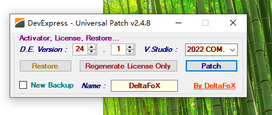
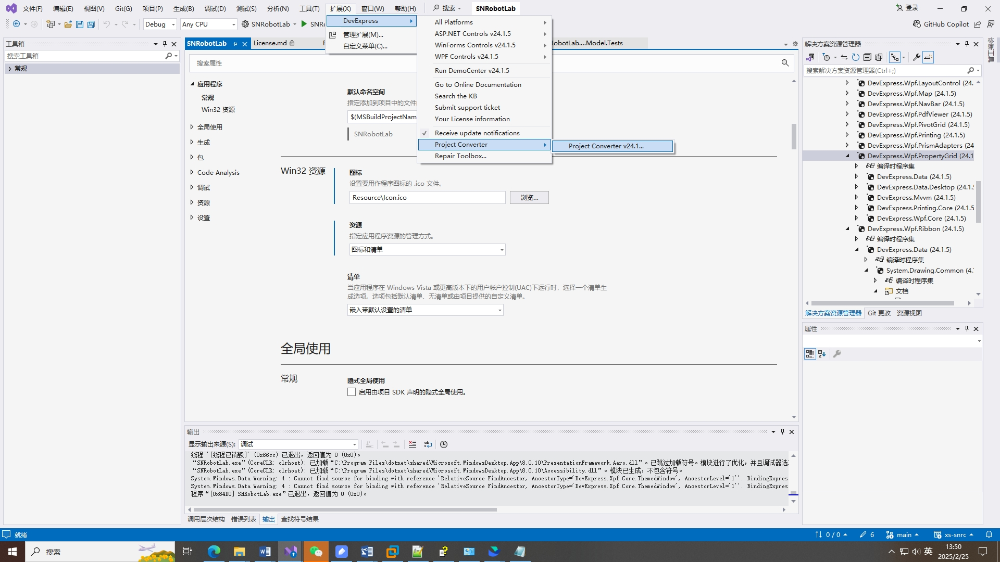

## 安装教程

1. 找到破解包
2. 先安装：DevExpressUniversalTrialCompleteSetup-20240815-24.1.5.exe
3. "病毒与威胁防护" -> "管理设置" -> "实时保护" -> 关闭
4. 解压，安装：DevExpress.Universal.Patch.v2.4.8 (否则会被删除)
   
   

   选择visual studio版本 + DevExpress版本。DevExpress版本就是安装包名字的版本，这里是24.1

   然后点Patch

4. 之后可以在工具箱看到相关控件，也可以在菜单栏 -> 扩展中查看DevExpress的相关信息
5. 由于项目中用的DevExpress版本可能不一致，需要处理下
   
   

6. 例子：`C:\Users\Public\Documents\DevExpress Demos 24.1\Components`
7. 其他例子：

## 基础操作

[Menu Entries](https://docs.devexpress.com/WPF/16772/whats-installed/menu-entries)

[Quick Actions](https://docs.devexpress.com/WPF/402198/whats-installed/smart-tags/suggested-actions)(vs 2019以后支持)

[DevExpress Image Picker](https://docs.devexpress.com/WPF/120093/common-concepts/images/devexpress-image-gallery)

   

## 案例

1. 日志需要是单例，且是线程安全的

## 参考资料

- [DevExpress版本](https://www.devexpress.com/buy/winforms-wpf-blazor-asp-net-maui/)
- [DevExpress WPF控件](https://docs.devexpress.com/WPF/7875/wpf-controls)(有控件的各自教程)
   - [WPF Interactive Demos](https://docs.devexpress.com/WPF/14978/whats-installed/interactive-demos)(DevExpress安装后的一些资源介绍)
- [Getting Started](https://docs.devexpress.com/WPF/401166/dotnet-core-support/getting-started)