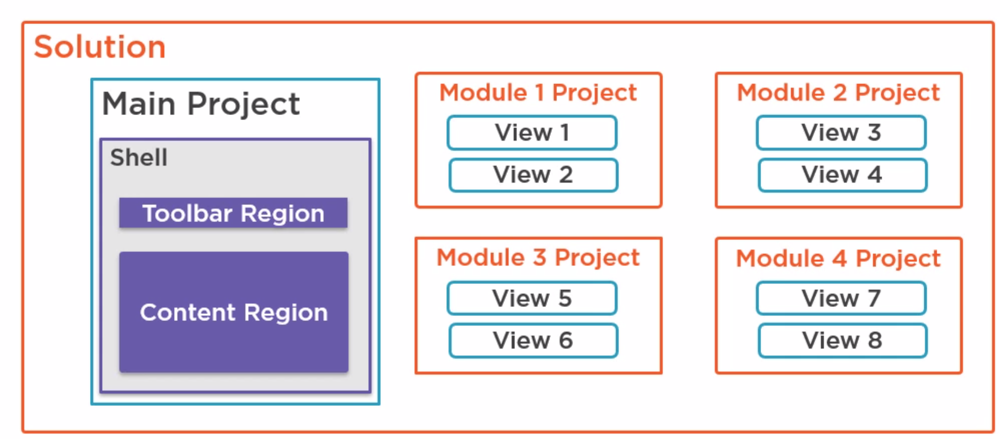

## 关键词

1. MVVM
2. Prism使用依赖注入模式，因此需要了解依赖注入和IoC容器
3. Prism提供了一种事件聚合器，使得各个模块之间可以进行松耦合的通信。
4. xaml自动格式化
5. CommunityToolkit
6. Prism.Unity
7. DevExpress
8. Ribbon

## 笔记

1. shell就是页面(Main Application Window)的意思
2. Prism.Wpf依赖 Prism.Core; Prism.DryIoc/Prism.Unity(依赖注入容器), 这2个依赖Prism.Wpf和Prism.Core。安装Prism时，只需要安装Prism.DryIoc/Prism.Unity
3. 需要装插件：Xaml格式化工具、Prism Template Pack
4. Button的基类是ButtonBase，ButtonBase的基类是ContentControl，ContentControl的基类是Control
5. RegionAdapter支持包含了ContentControlRegionAdapter/ItemsControlRegionAdapter/SelectorRegionAdapter，其他类型的control需要实现自定义的RegionAdapter。比如stackPanel就默认不支持。
6. module概念
   
   

## 参考资料

Prism提供了包括MVVM、依赖注入、命令和事件聚合器等设计模式，这些设计模式有助于编写效果良好且可维护的XAML应用程序

- [Empower Your XAML Applications](https://prismlibrary.com/)
  - [Introduction to Prism 7 for WPF](https://www.pluralsight.com/courses/prism-wpf-introduction?clickid=ROdXhfRqWxyKR8EwyXTfu3VWUkswMXxvG0ebWo0&irgwc=1&mpid=2385426&aid=7010a000001xAKZAA2&utm_medium=digital_affiliate&utm_campaign=2385426&utm_source=impactradius)
- [Introduction to Prism](https://prismlibrary.github.io/docs/)
  - [Prism简介](https://csharpshare.com/articles/framework/prism-doc/index.html)
  - [NuGet包中库的介绍](https://csharpshare.com/articles/framework/prism-doc/getting-started/NuGet-Packages.html)
- [Github-Prism](https://github.com/PrismLibrary/Prism)
  - [Prism-Samples-Wpf](https://github.com/PrismLibrary/Prism-Samples-Wpf)